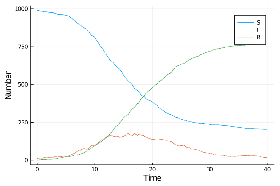

# Stochastic differential equation
Simon Frost (@sdwfrost), 2020-04-27

## Introduction

A stochastic differential equation version of the SIR model is:

- Stochastic
- Continuous in time
- Continuous in state

## Libraries

````julia
using DifferentialEquations
using SimpleDiffEq
using Distributions
using Random
using DataFrames
using StatsPlots
using BenchmarkTools
````


## Transitions

````julia
function sir_sde!(du,u,p,t)
    (S,I,R) = u
    (β,c,γ,δt) = p
    N = S+I+R
    ifrac = β*c*I/N*S*δt
    rfrac = γ*I*δt
    ifrac_noise = sqrt(ifrac)*rand(Normal(0,1))
    rfrac_noise = sqrt(rfrac)*rand(Normal(0,1))
    @inbounds begin
        du[1] = S-(ifrac+ifrac_noise)
        du[2] = I+(ifrac+ifrac_noise) - (rfrac + rfrac_noise)
        du[3] = R+(rfrac+rfrac_noise)
    end
    for i in 1:3
        if du[i] < 0 du[i]=0 end
    end
    nothing
end;
````


````
sir_sde! (generic function with 1 method)
````


## Time domain

Note that even though we're using fixed time steps, `DifferentialEquations.jl` complains if I pass integer timespans, so I set the timespan to be `Float64`.

````julia
δt = 0.1
nsteps = 400
tmax = nsteps*δt
tspan = (0.0,nsteps)
t = 0.0:δt:tmax;
````


````
0.0:0.1:40.0
````


## Initial conditions

````julia
u0 = [990.0,10.0,0.0]; # S,I,R
````


````
3-element Array{Float64,1}:
 990.0
  10.0
   0.0
````


## Parameter values

````julia
p = [0.05,10.0,0.25,δt]; # β,c,γ,δt
````


````
4-element Array{Float64,1}:
  0.05
 10.0
  0.25
  0.1
````


## Random number seed

````julia
Random.seed!(1234);
````


````
MersenneTwister(UInt32[0x000004d2], Random.DSFMT.DSFMT_state(Int32[-1393240
018, 1073611148, 45497681, 1072875908, 436273599, 1073674613, -2043716458, 
1073445557, -254908435, 1072827086  …  -599655111, 1073144102, 367655457, 1
072985259, -1278750689, 1018350124, -597141475, 249849711, 382, 0]), [0.0, 
0.0, 0.0, 0.0, 0.0, 0.0, 0.0, 0.0, 0.0, 0.0  …  0.0, 0.0, 0.0, 0.0, 0.0, 0.
0, 0.0, 0.0, 0.0, 0.0], UInt128[0x00000000000000000000000000000000, 0x00000
000000000000000000000000000, 0x00000000000000000000000000000000, 0x00000000
000000000000000000000000, 0x00000000000000000000000000000000, 0x00000000000
000000000000000000000, 0x00000000000000000000000000000000, 0x00000000000000
000000000000000000, 0x00000000000000000000000000000000, 0x00000000000000000
000000000000000  …  0x00000000000000000000000000000000, 0x00000000000000000
000000000000000, 0x00000000000000000000000000000000, 0x00000000000000000000
000000000000, 0x00000000000000000000000000000000, 0x00000000000000000000000
000000000, 0x00000000000000000000000000000000, 0x00000000000000000000000000
000000, 0x00000000000000000000000000000000, 0x00000000000000000000000000000
000], 1002, 0)
````


## Running the model

````julia
prob_sde = DiscreteProblem(sir_sde!,u0,tspan,p)
````


````
DiscreteProblem with uType Array{Float64,1} and tType Float64. In-place: tr
ue
timespan: (0.0, 400.0)
u0: [990.0, 10.0, 0.0]
````


````julia
sol_sde = solve(prob_sde,solver=FunctionMap);
````


````
retcode: Success
Interpolation: left-endpoint piecewise constant
t: 401-element Array{Float64,1}:
   0.0
   1.0
   2.0
   3.0
   4.0
   5.0
   6.0
   7.0
   8.0
   9.0
   ⋮
 392.0
 393.0
 394.0
 395.0
 396.0
 397.0
 398.0
 399.0
 400.0
u: 401-element Array{Array{Float64,1},1}:
 [990.0, 10.0, 0.0]
 [988.8947671522094, 11.30610475571904, 0.0]
 [988.7055274430037, 11.69272699154772, 0.0]
 [987.4706638900711, 11.439388577532924, 1.4882019669473676]
 [986.5057382330858, 12.263646921629789, 1.6288692798357647]
 [985.5104541149187, 13.238597190929257, 1.6492031287034035]
 [985.3109877737326, 13.118197077827924, 1.9690695829908509]
 [984.5620377717174, 12.478152468995, 3.3580641938389024]
 [984.5966431703534, 12.070101461308104, 3.731509802889783]
 [984.1962508229602, 11.965649933497922, 4.23635367809324]
 ⋮
 [203.93798918731858, 20.11670266219165, 776.3435625850418]
 [203.93331045829538, 17.890067678388853, 778.5748762978678]
 [203.96220308765527, 17.43879995813703, 778.9972513887598]
 [203.76541827427786, 17.296012920495063, 779.3368232397792]
 [203.69082753114262, 15.647193547495467, 781.060233355914]
 [203.4023893577508, 16.33385318992283, 780.6620118868784]
 [203.51099967961449, 16.85237753507438, 780.0348772198632]
 [203.65506395608364, 15.662816464260057, 781.0803740142084]
 [203.17463327529836, 14.383186887926252, 782.8404342713275]
````


## Post-processing

We can convert the output to a dataframe for convenience.

````julia
df_sde = DataFrame(sol_sde')
df_sde[!,:t] = t;
````


````
0.0:0.1:40.0
````


## Plotting

We can now plot the results.

````julia
@df df_sde plot(:t,
    [:x1 :x2 :x3],
    label=["S" "I" "R"],
    xlabel="Time",
    ylabel="Number")
````





## Benchmarking

````julia
@benchmark solve(prob_sde,solver=FunctionMap)
````


````
BenchmarkTools.Trial: 
  memory estimate:  58.73 KiB
  allocs estimate:  472
  --------------
  minimum time:     67.952 μs (0.00% GC)
  median time:      78.858 μs (0.00% GC)
  mean time:        90.907 μs (8.20% GC)
  maximum time:     25.619 ms (96.86% GC)
  --------------
  samples:          10000
  evals/sample:     1
````


## Appendix
### Computer Information
```
Julia Version 1.4.1
Commit 381693d3df* (2020-04-14 17:20 UTC)
Platform Info:
  OS: Linux (x86_64-pc-linux-gnu)
  CPU: Intel(R) Core(TM) i7-1065G7 CPU @ 1.30GHz
  WORD_SIZE: 64
  LIBM: libopenlibm
  LLVM: libLLVM-8.0.1 (ORCJIT, icelake-client)
Environment:
  JULIA_NUM_THREADS = 4

```

### Package Information

```
Status `~/.julia/environments/v1.4/Project.toml`
[46ada45e-f475-11e8-01d0-f70cc89e6671] Agents 3.1.0
[c52e3926-4ff0-5f6e-af25-54175e0327b1] Atom 0.12.11
[6e4b80f9-dd63-53aa-95a3-0cdb28fa8baf] BenchmarkTools 0.5.0
[a134a8b2-14d6-55f6-9291-3336d3ab0209] BlackBoxOptim 0.5.0
[2445eb08-9709-466a-b3fc-47e12bd697a2] DataDrivenDiffEq 0.2.0
[a93c6f00-e57d-5684-b7b6-d8193f3e46c0] DataFrames 0.21.0
[ebbdde9d-f333-5424-9be2-dbf1e9acfb5e] DiffEqBayes 2.14.0
[459566f4-90b8-5000-8ac3-15dfb0a30def] DiffEqCallbacks 2.13.2
[c894b116-72e5-5b58-be3c-e6d8d4ac2b12] DiffEqJump 6.7.5
[1130ab10-4a5a-5621-a13d-e4788d82bd4c] DiffEqParamEstim 1.14.1
[0c46a032-eb83-5123-abaf-570d42b7fbaa] DifferentialEquations 6.14.0
[31c24e10-a181-5473-b8eb-7969acd0382f] Distributions 0.23.2
[634d3b9d-ee7a-5ddf-bec9-22491ea816e1] DrWatson 1.11.0
[587475ba-b771-5e3f-ad9e-33799f191a9c] Flux 0.8.3
[28b8d3ca-fb5f-59d9-8090-bfdbd6d07a71] GR 0.49.1
[523d8e89-b243-5607-941c-87d699ea6713] Gillespie 0.1.0
[7073ff75-c697-5162-941a-fcdaad2a7d2a] IJulia 1.21.2
[4076af6c-e467-56ae-b986-b466b2749572] JuMP 0.21.2
[e5e0dc1b-0480-54bc-9374-aad01c23163d] Juno 0.8.2
[093fc24a-ae57-5d10-9952-331d41423f4d] LightGraphs 1.3.3
[1914dd2f-81c6-5fcd-8719-6d5c9610ff09] MacroTools 0.5.5
[ee78f7c6-11fb-53f2-987a-cfe4a2b5a57a] Makie 0.9.5
[961ee093-0014-501f-94e3-6117800e7a78] ModelingToolkit 3.6.0
[76087f3c-5699-56af-9a33-bf431cd00edd] NLopt 0.6.0
[429524aa-4258-5aef-a3af-852621145aeb] Optim 0.21.0
[1dea7af3-3e70-54e6-95c3-0bf5283fa5ed] OrdinaryDiffEq 5.38.1
[91a5bcdd-55d7-5caf-9e0b-520d859cae80] Plots 1.3.1
[428bdadb-6287-5aa5-874b-9969638295fd] SimJulia 0.8.0
[05bca326-078c-5bf0-a5bf-ce7c7982d7fd] SimpleDiffEq 1.1.0
[f3b207a7-027a-5e70-b257-86293d7955fd] StatsPlots 0.14.6
[789caeaf-c7a9-5a7d-9973-96adeb23e2a0] StochasticDiffEq 6.23.0
[fce5fe82-541a-59a6-adf8-730c64b5f9a0] Turing 0.12.0
[44d3d7a6-8a23-5bf8-98c5-b353f8df5ec9] Weave 0.10.0
```
